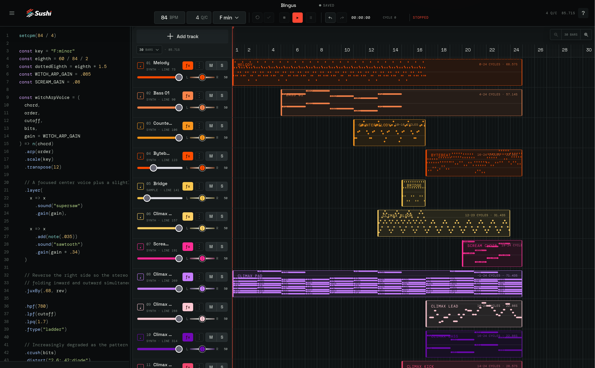

<p align="center">
  <picture>
    <source media="(prefers-color-scheme: dark)" srcset="./public/logos/brand-wordmark-white.png">
    <source media="(prefers-color-scheme: light)" srcset="./public/logos/brand-wordmark-dark.png">
    
  </picture>
</p>

# Sushi

Sushi is a browser-based reimplementation of [Strudel](https://strudel.tidalcycles.org/) for importing, writing, and arranging music with [Tidal Cycles](https://tidalcycles.org/) syntax.

Compose in a source editor as you would in a live-coding environment, or use Sushi’s visual studio to organize tracks and patterns on a timeline like a traditional DAW. The source and arrangement share one musical workspace, so code, controls, and playback stay connected.

Try it live at [sushidaw.com](https://sushidaw.com/).

<p align="center">
  <picture>
    
  </picture>
</p>

## Highlights

- Bring in existing Strudel source or write new patterns with Tidal Cycles mini-notation.
- Arrange pattern-based tracks and sections on a visual timeline.
- Shape tempo, key, gain, pan, effects, and playback from the studio.
- Open supported lanes in a live piano-roll editor with source-backed note placement, pitch dragging, grid-snapped edge trimming, deletion, and duration editing.
- Save, reopen, import, and export portable `.sushi.json` projects.
- Hear compositions through Strudel and Web Audio.
- Use optional WebMCP integration to let compatible agents inspect the studio, edit source, control playback, and assist with composition.

## Example

```js
setcpm(120 / 4)

$: s("bd ~ sd ~")
  .gain(0.8)

$: note("<c3 eb3 g3 bb3>")
  .s("sawtooth")
  .lpf(900)
```

## Agent-assisted composition

Sushi uses [WebMCP](https://webmachinelearning.github.io/webmcp) to connect compatible agents to the studio. Agents can read and modify source, inspect musical state, and control playback, making it possible to collaborate on patterns and arrangements through natural-language assistance.

The WebMCP integration also exposes the curated editor templates: agents can use `list_editor_templates` to browse available compositions, `view_editor_template` to inspect one, and `load_editor_template` to load it into the current session. 

## How to test WebMCP (ChatGPT)

No account is required.

Open the live application in ChatGPT’s in-app browser, or in Chrome 149+ with WebMCP enabled through `chrome://flags/#enable-webmcp-testing`.

Ask the agent:

```
Open the current Sushi studio session. Inspect the current revision, list the available editor templates, load one, set the tempo to 128 BPM, validate the Strudel source, and start playback. Report the resulting revision and any diagnostics.
```

Expected result:

1. The agent discovers Sushi’s WebMCP tools.
2. It inspects the current project and revision.
3. It loads a composition and changes its tempo.
4. The source and visual studio update together.
5. The source validates successfully.
6. Playback begins.

(Browser audio policies may require one initial user gesture. Click Play once if the browser reports that audio is locked.)

## Run locally

```sh
bun install
bun run dev
```

Build the application with:

```sh
bun run build
```

Experimental MIDI is disabled by default in every environment, including local development and production builds. Explicitly opt in only when testing the experimental surface:

```sh
VITE_EXPERIMENTAL_MIDI=true bun run dev
```

Only the exact value `true` enables MIDI. An absent, empty, malformed, or any other value disables it. Leave this variable unset for the hackathon build.

## Built with gratitude

Sushi builds on the work of:

- [Strudel](https://codeberg.org/uzu/strudel) and [`@strudel/web`](https://www.npmjs.com/package/@strudel/web) for the pattern language, musical runtime, scheduling, synthesis, and browser audio.
- [Tidal Cycles](https://tidalcycles.org/) for the pattern language tradition and mini-notation that make expressive live-coded music possible.
- [Astro](https://astro.build/) and [React](https://react.dev/) for the application shell and interactive studio.
- [WebMCP](https://webmachinelearning.github.io/webmcp) for the browser interface that connects web applications with AI agents.
